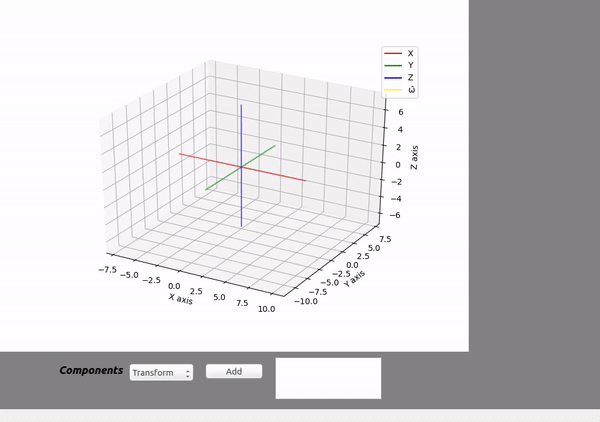
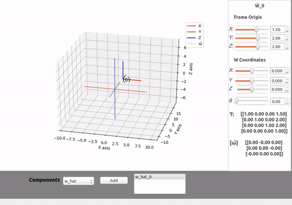
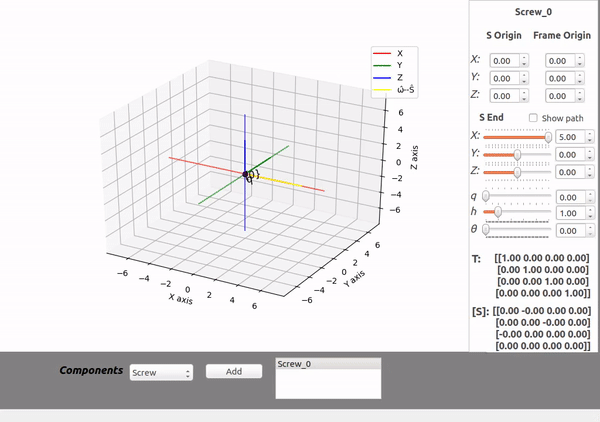

# Modern Robotics Visualizer
A Python visualization helper for the first and fundamentals topics from Coursera's Modern Robotics Specialization.

- **Course link:** https://www.coursera.org/specializations/modernrobotics

**Dependencies:**
- modern_robotics ( Specialization package -> pip install modern_robotics )
- PyQt 5.5
- Numpy

### Usage
    python mr_visualizer.py

**Transformation:-**

**W_hat rotation vector:-**

**Screw axis Rotation/Translation vector:-**

License
----

MIT
